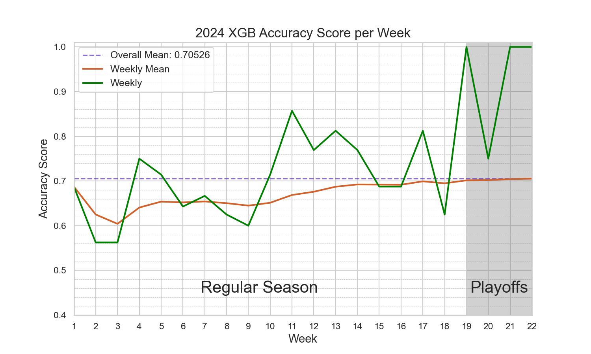

# NFL Prediction
Welcome to my NFL Prediction repository! This project uses machine learning to predict the outcomes of future NFL games based on various features. The goal of this project is to get the most out of simple features via feature engineering.

# Calculated Features
## Elo Ratings
+ **Team Elo Ratings:** Each NFL team is assigned an Elo rating, which reflects its overall performance and strength relative to other teams.
+ **Quarterback Elo Ratings:** Elo ratings for individual quarterbacks.
+ **Coach Elo Ratings:** Elo ratings for individual coaches.
## Average Points
+ **Average Points Scored:** Average points scored by each team, displaying the offensive strength of a team.
+ **Average Points Allowed:** Average points allowed by each team, displaying the defensive strength of a team.

# Performance
The best model has a accuracy of 67.0% predicting the winners of NFLs 2023 Season games.
This model is a RandomForest and uses:
+ **alpha = 0.7 :** Controls elo rating reset at the start of each season with 0 = Hard Reset and 1 = No Reset. So 0.7 is considered a soft reset.
+ **week_change = 3 :** Indicates at which week into the season the model starts using the current season average points & points allowed instead of using the average of the last x seasons.
+ **last_seasons = 2 :** Determines how many of the last seasons are included in the calculation of the average points & points allowed.

# Future Improvements
+ Implement Web Crawling for automated Data Imputation
+ Enhance existing features
+ Create additional features
+ Ensembling

# Data Source
The data used in this project originates from [nflverse/nfldata](https://github.com/nflverse/nfldata).
